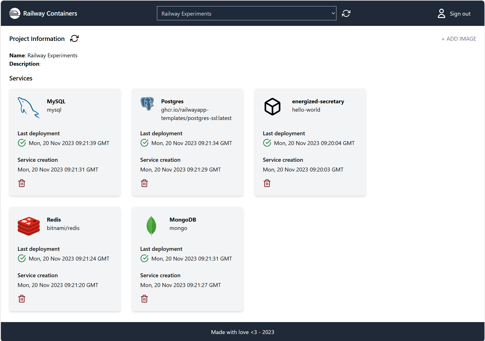

# Railway Containers

Small project to spin up and spin down a container using the Railway GQL API.

[Live example](https://railway-containers.up.railway.app/)

You'll need a token to sign in.

https://github.com/robertohuertasm/railway-containers/assets/696981/2863a16d-7ee7-44ef-b1d2-9d7dbdd6613b
